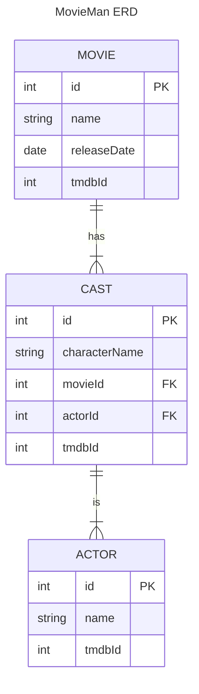

# Database Entity Relationships

```mermaid
---
title: MovieMan ERD
---
erDiagram
    MOVIE ||--|{ CAST : has
    MOVIE {
        int id PK
        string name
        date releaseDate
        int tmdbId
    }
    CAST ||--|{ ACTOR: is
    CAST {
        int id PK
        string characterName
        int movieId FK
        int actorId FK
        int tmdbId
    }
    ACTOR {
        int id PK
        string name
        int tmdbId
    }
```