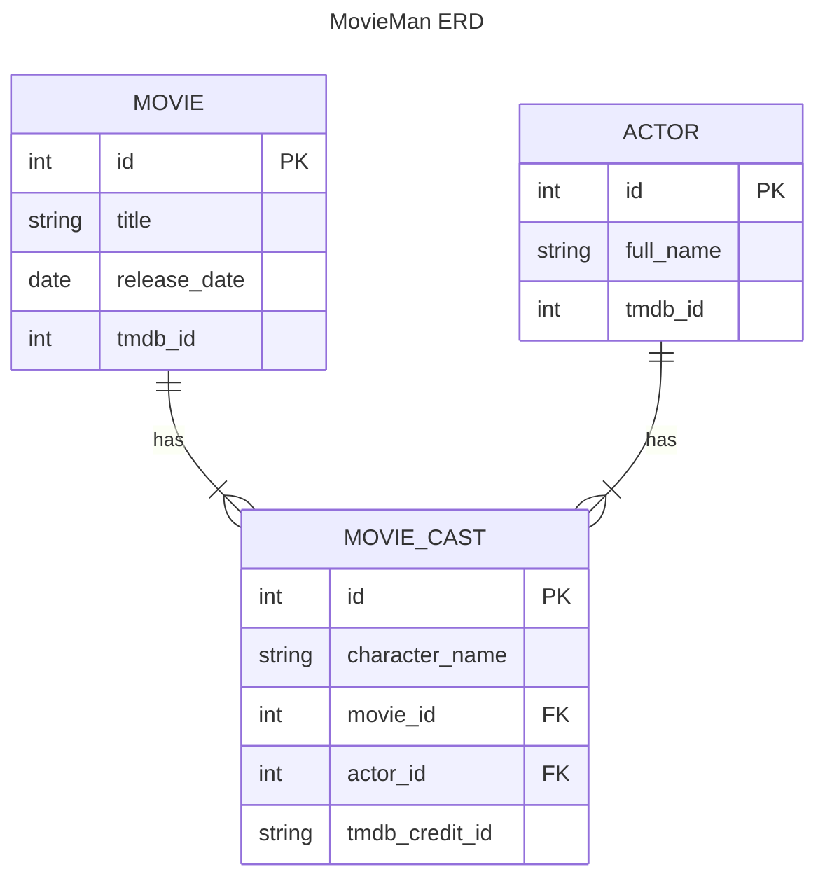

# Database Entity Relationships

```mermaid
---
title: MovieMan ERD
---
erDiagram
    MOVIE ||--|{ MOVIE_CAST : has
    MOVIE {
        int id PK
        string title
        date release_date
        int tmdb_id
    }
    ACTOR ||--|{ MOVIE_CAST: has
    ACTOR {
        int id PK
        string full_name
        int tmdb_id
    }
    MOVIE_CAST {
        int id PK
        string character_name
        int movie_id FK
        int actor_id FK
        string tmdb_credit_id
    }
```