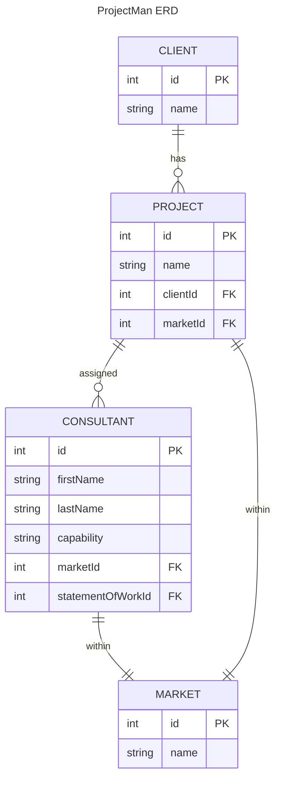

# Database Entity Relationships

```mermaid
---
title: ProjectMan ERD
---
erDiagram
    CLIENT ||--o{ PROJECT : has
    CLIENT {
        int id PK
        string name
    }
    PROJECT {
        int id PK
        string name
        int clientId FK
        int marketId FK
    }
    PROJECT ||--o{ CONSULTANT : assigned
    CONSULTANT {
        int id PK
        string firstName
        string lastName
        string capability
        int marketId FK
        int statementOfWorkId FK
    }
    CONSULTANT ||--|| MARKET : within
    PROJECT ||--|| MARKET : within
    MARKET {
        int id PK
        string name
    }
```